# Amplenote Kanban Plugin — Backend Validation & Live Testing Checklist

This document contains the complete technical verification of all Amplenote backend API integrations, insights from legacy plugin usage (1,000+ active users), architectural evolution comparisons, and a comprehensive manual testing checklist for live environment validation.

---

## 1. Amplenote Backend API Integration & Validation

All operations across notes, headers, tasks, tabs, and buttons have been validated against the official [Amplenote Plugin API Reference](https://www.amplenote.com/help/developing_amplenote_plugins/app_interface) and local reference files in [`../amplenote_references/`](../amplenote_references/).

| Feature / Action | Amplenote Backend API Used | Technical Implementation & Safeguards | Source Module |
| :--- | :--- | :--- | :--- |
| **Launch Plugin Embed** | `app.openEmbed()` + `app.navigate()` | Opens persistent full-page embed view and navigates to the plugin URL (`https://www.amplenote.com/notes/plugins/{uuid}`). | [`kanban.js`](./kanban.js) |
| **Create Note Board Tab** | `app.createNote(title, ["-reports/-kanban"])` | Automatically creates a new note in `-reports/-kanban` and seeds it with default markdown columns (`# To Do\n\n# In Progress\n\n# Done\n`). | [`lib/features/embedActions.js`](./lib/features/embedActions.js) |
| **Link Existing Note Tab** | `app.prompt()` with `{ type: "note" }` | Returns a `noteHandle` object with `uuid` and `name`. Headings become columns; tasks become cards. | [`lib/features/embedActions.js`](./lib/features/embedActions.js) |
| **Tag Board Tab (Collapsible)** | `app.filterNotes({ tag })` + `app.getTags()` | Queries live notes matching the tag. Resolves tag badge colors from Amplenote account palette. Headings inside notes become collapsible sections. | [`lib/api/tagBoard.js`](./lib/api/tagBoard.js) |
| **Multi-Note Board Tab (Flat)** | `app.filterNotes({ tag })` + `app.getNoteTasks()` | Queries live notes matching the tag; each note is a column with flat task cards. | [`lib/api/notesBoard.js`](./lib/api/notesBoard.js) |
| **Create Task / Card (`+`)** | `app.insertTask({ uuid }, { content })` | Inserts task in note under specific column heading via `createTaskInColumn`, or directly at top of note (Unsorted) via right-end `+ Add Task` / empty state action. | [`lib/api/taskOps.js`](./lib/api/taskOps.js) |
| **Move Task (Drag & Drop)** | `app.replaceNoteContent({ uuid }, markdown)` | Uses exact task line index matching (`<!-- {"uuid":"..."} -->`). Shows 3px glowing visual drop indicator lines above/below target card. Supports relative positioning (before/after target card) both across headings and within the same heading. Moving to the Completed / Done column auto-completes the task (`completedAt: unixSeconds`). Moving out reopens it (`completedAt: null`). | [`lib/api/taskOps.js`](./lib/api/taskOps.js) |
| **Move Task Across Notes** | `app.replaceNoteContent()` + `app.insertTask()` | Migrates task across notes by splicing from source note markdown and inserting into target note via Amplenote API. | [`lib/features/embedActions.js`](./lib/features/embedActions.js) |
| **Edit Task Details (Dialog)** | `app.updateTask(taskUUID, updates)` | Full modal editor updating `content`, `important`, `urgent`, `score`, `startAt`, `completedAt`, `dismissedAt`, `hideUntil`, and heading relocation. | [`lib/features/embedActions.js`](./lib/features/embedActions.js) |
| **Add / Rename Column** | `app.insertNoteContent()` / `app.replaceNoteContent()` / `app.setNoteName()` | Supports H1/H2/H3 levels. For tag/multi-note boards, modifies note titles directly via API. | [`lib/api/columnOps.js`](./lib/api/columnOps.js) |
| **Delete Column** | Line extraction + `app.replaceNoteContent()` | **Zero-data-loss protection**: existing tasks in the deleted column are safely relocated into the previous header (or next header if first) before the heading is removed. | [`lib/api/columnOps.js`](./lib/api/columnOps.js) |
| **Transfer Column to Another Note** | Target insert + Source remove | Inserts into target note first before removing from source note to guarantee zero data loss on network failure. | [`lib/api/columnOps.js`](./lib/api/columnOps.js) |
| **Rich Footnotes & Images** | `app.htmlFromContent(content)` | Renders Amplenote's native editor HTML markup, footnotes, links, and extracts the first image preview. | [`lib/api/noteBoard.js`](./lib/api/noteBoard.js) |
| **Settings & Tabs Config** | `app.getSetting()` / `app.setSetting()` | Persists active tab, tab order, themes, WIP limits, date formats, and view preferences. | [`lib/core/settings.js`](./lib/core/settings.js) |

---

## 2. Key Insights & Architecture Comparison with Legacy Plugins

Comparison between legacy scripts ([`kanban-board.js`](./kanban-board.js) & [`kanban-old.js`](./kanban-old.js)) and the new modular codebase:

### 2.1. Task Metadata Identification & Parsing
- **Legacy Strategy**: Relied on rigid sequential regex `/- \[ \] (.+?)<!-- {"uuid":"(.+?)"} -->/g` or naive string matching `.includes('"uuid":"' + uuid + '"')`. Broke on checked tasks (`- [x]`), custom attributes, or nested formatting. Iterated line-by-line with synchronous individual `await app.getTask(uuid)` calls ($N$ round-trips).
- **Our Implementation**: Built [`UUID_IN_LINE_RE(uuid)`](./lib/api/markdownIndex.js) in [`lib/api/markdownIndex.js`](./lib/api/markdownIndex.js). Fetches all tasks in a single bulk API query (`app.getNoteTasks`) and builds an in-memory `Map<uuid, lineIndex>` for $O(1)$ line resolution across any task state.

### 2.2. Whole-Note Line Diffing vs Destructive Overwrites
- **Legacy Strategy**: `kanban-board.js` completely replaced note contents with `embed_code + '\n\n' + args[1]`, wiping out preambles, notes, and custom text. `kanban-old.js` performed basic array splicing without heading boundary detection, causing sub-heading content to be misplaced or truncated.
- **Our Implementation**: Introduced **Column Spans** in [`lib/api/markdownIndex.js`](./lib/api/markdownIndex.js) (`buildColumnSpans`). Note text is partitioned into bounded spans `[startLine, contentStart, contentEnd)`. Task moves in [`lib/api/taskOps.js`](./lib/api/taskOps.js) use `removeLine` + index-shifted `insertUnderHeading`. Only the target line moves; note preambles, formatting, and non-task text remain 100% intact.

### 2.3. Safe Column Transfers & Zero-Loss Deletions
- **Legacy Strategy**: Cross-note column migration did not exist; column deletion was unhandled.
- **Our Implementation**: Implemented a **Two-Phase Commit Protocol** in [`lib/api/columnOps.js: transferColumn`](./lib/api/columnOps.js):
  1. *Phase 1 (Insert Target)*: Appends heading + content to destination note via `app.insertNoteContent({ atEnd: true })`.
  2. *Phase 2 (Remove Source)*: Deletes heading and content from source note *only after* Phase 1 completes successfully.
  In addition, column deletion automatically relocates tasks to the top of the note (above all headings) before removing the heading.

```mermaid
flowchart TD
    subgraph Legacy Architecture
        L1[Single Embedded Object] --> L2[Direct replaceNoteContent overwrite]
        L2 --> L3[Sync app.getTask per line]
        L3 --> L4[Risk of preamble loss & rate limits]
    end

    subgraph Modern anp-15-kanban Architecture
        M1[Multi-Tab Persistent View] --> M2[Single Bulk API Queries]
        M2 --> M3[Markdown Indexer & Column Spans]
        M3 --> M4[Non-Destructive Line Diff Mutations]
        M4 --> M5[Two-Phase Safe Transfers & Zero-Loss Deletions]
    end
```

---

## 3. Live Environment Testing Checklist

### 3.1. Launch & Tab System
- [ ] **Launch**: Open via plugin launcher (`Open Kanban Board`); verify persistent embed view renders cleanly.
- [ ] **Create New Note Tab**: Click `+` tab -> choose *Create New Note Board* -> verify note is created in `-reports/-kanban` with default columns (`To Do`, `In Progress`, `Done`).
- [ ] **Link Existing Note Tab**: Click `+` tab -> choose *Existing Note Board* -> pick an existing note -> verify all headings appear as columns.
- [ ] **Tag Board Tab (Collapsible Headings)**: Click `+` tab -> choose *Tag Board* -> enter a tag (e.g. `projects`) -> verify all notes with that tag become columns, each with collapsible heading sections.
- [ ] **Multi-Note Board Tab (Flat Tasks)**: Click `+` tab -> choose *Multi-Note Board* -> verify notes become columns with flat task cards.
- [ ] **Tab Switching & Persistence**: Switch between tabs; verify active tab and state persist upon closing/reopening the embed.
- [ ] **Tab Drag & Drop Reordering**: Drag tabs left/right; verify order persists across reloads.
- [ ] **Close Tab**: Click `×` on a tab; confirm it closes and focuses the adjacent tab.
- [ ] **Single Tab Refresh**: Click tab refresh button; verify only active tab re-queries Amplenote.
- [ ] **All Tabs Refresh**: Click global refresh button; verify all tabs re-sync with progress indicator.
- [ ] **Note Board Navigation**: Click the **↗** tab tool icon or the top action bar **`↗ Open Note`** button -> verify Amplenote navigates directly to the source note.

---

### 3.2. Note Board Columns (Headings)
- [ ] **Add Column**: Click `+ Add Column` -> enter title & choose heading level (H1, H2, H3) -> check note markdown to verify the heading was appended.
- [ ] **Rename Column**: Click 3-dot menu on column -> *Rename* -> change name -> check note markdown to verify heading was renamed in place.
- [ ] **Reorder Columns (Drag & Drop)**: Drag column headers horizontally across any number of positions -> verify smooth zero-flicker live reordering -> check note markdown to verify heading sections and contents were reordered.
- [ ] **Move Column (Directional)**: Use 3-dot menu -> *Move Left* / *Move Right* -> verify column moves.
- [ ] **Delete Column**: Click 3-dot menu -> *Delete* -> confirm prompt -> verify heading is removed and tasks are safely relocated into the previous header (or next header if first) with zero tasks lost.
- [ ] **Set WIP Limit**: Click 3-dot menu -> *Set WIP limit* -> enter a number (e.g. `3`) -> verify limit badge appears and turns warning red when exceeded.
- [ ] **Move Column to Another Board**: Click 3-dot menu -> *Move Column to Tab* -> pick destination note -> confirm heading and its tasks moved to the other note.

---

### 3.3. Task / Card Operations
- [ ] **Visual Drop Indicator Lines**: Drag a card over another card -> verify horizontal 3px glowing accent line appears above or below the target card.
- [ ] **Intra-Header Reordering**: Drag a card to a different position within the *same* column (above or below an existing card) -> verify note markdown updates with the exact new order.
- [ ] **Cross-Header Relative Placement**: Drag a card to a specific position (e.g. position 3) in *another* column -> verify note markdown places the task directly at that position.
- [ ] **Add Task (`+` Button)**: Click `+` at bottom of any column -> enter task markdown -> verify task is created directly under that heading in the note.
- [ ] **Auto-Complete in Done Column**: Drag an active card into a column named `Done` / `Completed` -> verify task is crossed out and completed in Amplenote. Moving into regular custom columns (e.g. `Testing Header 2`) keeps the task active.
- [ ] **Auto-Reopen from Done Column**: Drag a completed card out of a `Done` column into a normal column -> verify task is reopened.
- [ ] **Card Click (Edit Task Details)**: Click card -> modify content, toggle Important/Urgent, set Score, change Status -> verify changes reflect in Amplenote task.
- [ ] **3-Dot Card Menu**:
  - [ ] *Mark as completed / Reopen task*: Click 3-dot -> select *Mark as completed* (or *Reopen task*) -> verify task completion state toggles.
  - [ ] *Add label (note link)*: Pick a note -> verify `[[Note Name]]` is added to task and colored label chip appears.
  - [ ] *Set start date / time*: Choose date & time -> verify start time chip appears on card.
  - [ ] *Snooze / Hide Until*: Set hide-until date -> verify saved to task.
  - [ ] *Schedule Time Block*: Set start & end dates/times -> verify calendar block info saved.
  - [ ] *Create note from card*: Prompts for note title -> creates fresh note with no tags -> links `[Title](https://www.amplenote.com/notes/{uuid})` into task -> clicking link navigates to note.
- [ ] **Quick Date (`@` Button)**: Hover over card -> click `@` -> pick date -> verify task start date is updated.
- [ ] **Note Links & Outside Link Safety**: Click note link -> verify navigates in Amplenote; click external link -> verify outside link toast alert.
- [ ] **Tag & Label Chips**: Add `#tag` or `#parent/subtag` to task -> verify colored chip appears below task title matching account palette.
- [ ] **Parent & Child Task Hierarchy**: Verify parent tasks show `📋 Parent Task` badge; indented subtasks show `↳ Child Task` / `↳↳ Child Task` with visual indentation and left accent lines.
- [ ] **Rich Footnotes & Image Preview**: Create a task with an image URL (``) -> verify image fits column width cleanly without `open_in_new` artifacts; click image -> verify full-resolution Lightbox modal opens with close button and Escape key support.

---

### 3.4. Tag & Multi-Note Boards
- [ ] **Create Note in Tag**: Click `+ Add Note` column -> enter title -> verify note is created with the board's tag and appears as a column.
- [ ] **Move Card Across Notes**: Drag a task card from Note A's column to Note B's column -> verify task moves note association.
- [ ] **Rename Note Column**: 3-dot menu on column -> *Rename Note* -> verify note title updates in Amplenote.
- [ ] **Delete Note Column**: 3-dot menu on column -> *Delete Note* -> confirm prompt -> verify note is moved to Amplenote trash.

---

### 3.5. Top Bar Controls & Settings
- [ ] **Theme Cycling**: Click Theme button -> cycle through light and dark themes -> verify contrast and aesthetic in both modes.
- [ ] **Show / Hide Empty Columns**: Click empty columns toggle -> verify empty notes or headings disappear/reappear.
- [ ] **Collapse / Expand All Card Info**: Click expand/collapse toggle -> verify cards switch between compact single-line and full preview.
- [ ] **Quick Date Toggle**: Toggle `@` button on top bar -> verify hover `@` icon on cards enables/disables.
- [ ] **Sort Mode**: Change sort dropdown (Score, Date, Important, Urgent) -> verify cards reorder on board.
- [ ] **Save Sort Order to Note**: Click *Save Sort to Note* -> confirm prompt -> check note markdown to verify physical task order matches dashboard sort.
- [ ] **Global Search**: Click search icon -> type note keyword -> select result -> verify Amplenote navigates to the note.
- [ ] **Custom Date Format**: Click Settings -> set date format tokens (e.g. `DD MMM YYYY`) -> verify card date chips format accordingly.
- [ ] **Sync Progress Bar**: Trigger a refresh (tab or all tabs) -> verify progress bar animates during data load.
